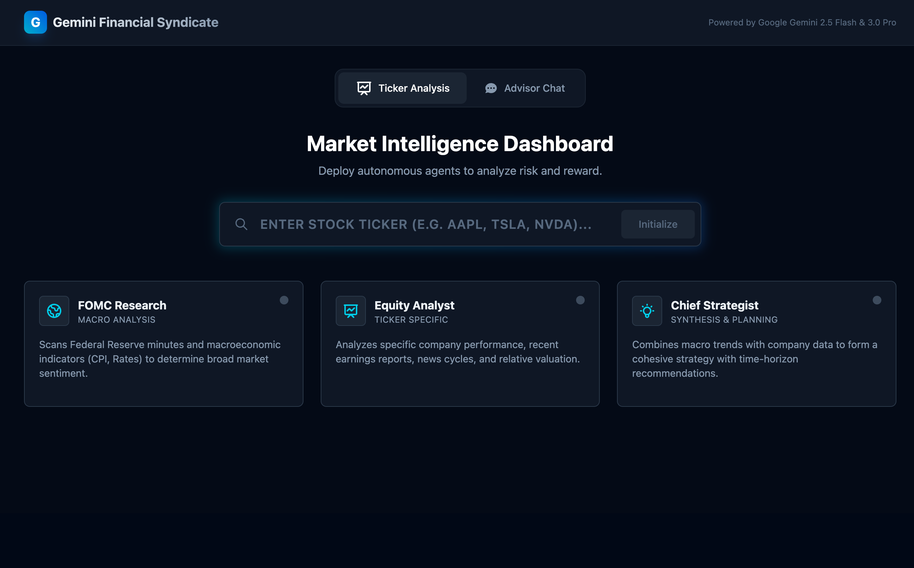
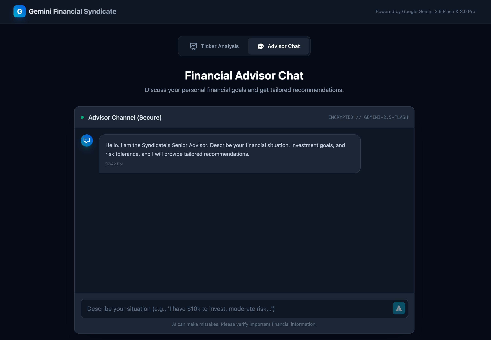

<div align="center">

# Financial Syndicate

[](https://docs.docker.com/compose/)
[](https://github.com/jleboube/Financial-Syndicate/stargazers)
[](https://github.com/jleboube/Financial-Syndicate/network/members)
[](https://github.com/jleboube/Financial-Syndicate/issues)
[](https://github.com/jleboube/Financial-Syndicate/pulls)
[](https://creativecommons.org/licenses/by-nc-sa/4.0/)

[](https://www.buymeacoffee.com/muscl3n3rd)

**WARNING: Trading stocks and crypto is very risky. This app is not intended for anyone that likes their money. This hasn't been backtested. This was literally one-shotted using Claude and I transferred $250 into the account and let the "Crypto Hunter" agent loose. Do not use this app if you want to save your money.**

[Demo](https://myfinancial.ai-sherpa.rocks) • [Screenshots](#screenshots) • [Features](#features) • [Local Deployment](#local-deployment) • [Architecture](#architecture)

</div>

A multi-agent financial analysis application powered by Google Gemini AI that provides comprehensive market insights through specialized AI agents.


## Screenshots





## Features

- **FOMC Policy Agent**: Analyzes Federal Reserve monetary policy decisions and their market implications
- **Ticker Analysis Agent**: Performs in-depth analysis of individual stock tickers including fundamental and technical analysis
- **Synthesis Agent**: Combines insights from multiple agents to provide comprehensive investment recommendations
- **Interactive Chat**: Real-time chat interface for querying financial information and getting personalized insights

## Prerequisites

- Docker and Docker Compose
- Google Gemini API Key

## Local Deployment

### 1. Clone the repository

```bash
git clone <repository-url>
cd financial-syndicate
```

### 2. Configure environment

Create a `.env` file in the project root:

```bash
cp .env.example .env
```

Edit `.env` and add your Gemini API key:

```
GEMINI_API_KEY=your_actual_api_key_here
```

### 3. Build and run with Docker Compose

```bash
docker-compose up --build
```

The application will be available at `http://localhost:47823`

### 4. Stop the application

```bash
docker-compose down
```

## Development

For local development without Docker:

1. Install dependencies:
```bash
npm install
```

2. Run development server:
```bash
npm run dev
```

The development server runs on port 3000 by default.

## Architecture

The application uses:
- React + TypeScript frontend
- Vite for build tooling
- Google Gemini AI for financial analysis
- Docker for containerization

## Port Configuration

Production deployment uses port `47823` for enhanced security through obscurity.